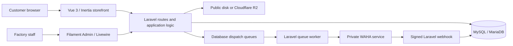
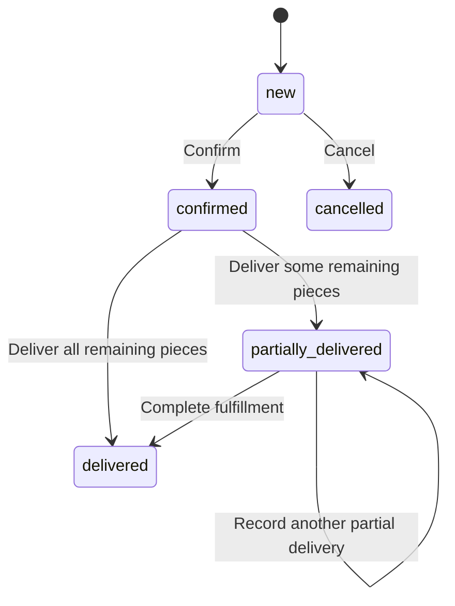

# Wholesale Order System

Owned, built and developed by **Mohamed Eid**.

An Arabic-first wholesale order platform for a shoe factory, built with Laravel, Vue, Inertia and Filament. Customers browse the catalog and submit color/size quantities without creating an account. Factory staff review orders, record fulfillment, inspect outstanding production requirements and export operational data to Excel.

The application is a single deployable Laravel monolith. It connects the customer storefront to factory operations while keeping the accounting system authoritative for product and customer codes.

## Contents

- [Capabilities](#capabilities)
- [Architecture and technology](#architecture-and-technology)
- [Business rules](#business-rules)
- [Local installation](#local-installation)
- [Configuration](#configuration)
- [Imports and exports](#imports-and-exports)
- [WhatsApp integration](#whatsapp-integration)
- [Development and verification](#development-and-verification)
- [Deployment and demo isolation](#deployment-and-demo-isolation)
- [Technical documentation](#technical-documentation)

## Capabilities

### Customer storefront

- Arabic and English interfaces, RTL/LTR layouts, responsive pages and a theme switcher.
- Catalog search by product name or code, category filtering and pagination.
- Product galleries, descriptions, related products and configurable color/size selection.
- Public-price and request-price products. Request-price products expose a contact action instead of their internal price.
- Session-backed cart with grouped variant selections, quantity editing and server-derived piece counts.
- Guest checkout capturing contact details, business name, address and order notes.
- Mobile-number matching for returning customers without customer accounts or public customer-history access.
- Order-number confirmation after submission.

### Factory administration

- Authenticated Filament panel with one operational Admin role.
- Categories, products, images, variants, configured colors/sizes and reference available quantities.
- Customer records, external customer codes, normalized contact numbers and marketing consent.
- Dedicated order management: review and edit new orders, confirm or cancel them, then record partial or complete fulfillment by ordered color.
- Five order statuses with counts and filters; delivered-order history and printable order sheets.
- Outstanding production requirements based on the remaining quantities of confirmed and partially delivered orders, with product filtering and color-level summaries.
- Product/customer spreadsheet imports, downloadable product-import template and Excel exports from operational screens.
- General settings for customer-service and manager contact numbers, with independent automatic-notification switches.

### WhatsApp operations

- WAHA account/session management and authenticated QR pairing from the Admin panel.
- Conversation inbox, customer matching, text replies and order-associated messaging.
- Message templates and automatic customer notifications for placement, confirmation, partial fulfillment and completion; manager alerts for new orders.
- Product-announcement campaigns with consent eligibility, pacing, pause/resume/cancel controls and recipient outcomes.
- Database-backed dispatch records, deduplication and conservative handling of uncertain provider outcomes.
- Signed inbound webhooks and provider delivery/read acknowledgement handling where identity correlation can be verified.

WhatsApp is optional and disabled in the example environment. Browsing, cart and order capture do not require an active provider account.

## Architecture and technology



| Layer | Technology | Responsibility |
| --- | --- | --- |
| Application | Laravel 12, PHP | Routing, validation, sessions, persistence and transactions |
| Storefront | Vue 3, Inertia 3 | Customer pages using Laravel routes and session state |
| Administration | Filament 4.13.2, Livewire | Operational resources, forms, tables and actions |
| Styling and build | Tailwind CSS 4, Vite 7 | Storefront/Admin styling and compiled assets |
| Database | MySQL-compatible engine | Business records, sessions, cache locks and queued jobs |
| Spreadsheets | Laravel Excel / PhpSpreadsheet | Row validation, XLSX generation and safe cell binding |
| Media | Laravel Filesystem / Flysystem | Local public files or S3-compatible Cloudflare R2 |
| Messaging | WAHA via Laravel HTTP client | Provider account, sends and inbound events |
| Verification | PHPUnit 11, Laravel Pint, Node test runner | Regressions, formatting and translation tests |

Dependency versions are recorded in [composer.lock](composer.lock) and [package-lock.json](package-lock.json). There is no separate customer API/SPA deployment, Redis requirement or external workflow engine.

## Business rules

1. **External codes remain authoritative.** `product_code` and `customer_code` align with the accounting system; this application does not replace it.
2. **Guest checkout.** Customer matching uses a normalized mobile number. A customer record is separate from an authenticated Admin user.
3. **Hidden prices stay server-side.** Public catalog/cart responses return no internal request-price value. Customer message templates also restrict hidden-price context.
4. **The server owns quantities and totals.** Checkout reloads current product/variant data and validates product activity and quantity distribution before creating records.
5. **Orders preserve snapshots.** Accepted product code/name, color/size and price context are stored on order items so later catalog edits do not rewrite historical orders.
6. **Creation is transactional.** Customer matching, order records, items and notification dispatch snapshots are handled inside database consistency boundaries. Queue publication waits for commit.
7. **Fulfillment is controlled.** Delivery changes lock the relevant records, validate remaining quantities and derive the resulting order status.
8. **Available quantity is a reference.** Orders and deliveries do not decrement `available_quantity`; it is not a reservation or inventory ledger.
9. **Exports preserve order-item grain.** An order-export row represents an accepted ordered variant/grouped selection snapshot. Production requirements use the finer outstanding ordered-color grain.



Only new orders are editable or cancellable. Confirmed orders enter execution. The system intentionally excludes payments, invoices, financial balances, stock movements, carrier integrations and customer login accounts.

## Local installation

### Prerequisites

- PHP 8.2 or newer compatible with the Composer lock; PHP 8.3 is the documented development target.
- Composer 2.
- Node.js 24 and npm, matching the Docker frontend build. The locked Vite package requires Node `^20.19.0 || >=22.12.0`.
- A dedicated local MySQL-compatible database; MariaDB 10.11 is an existing validation target.
- Required PHP extensions including PDO MySQL, mbstring, intl, bcmath, GD, XML/DOM and ZIP. Enable PDO SQLite/SQLite for the default test suite.

Run `composer check-platform-reqs` after installation to check the actual lockfile requirements.

### Install and initialize

```bash
git clone https://github.com/muhhammedeid/order-system.git
cd order-system
composer install
npm ci
```

Create a local environment file:

```bash
# macOS / Linux
cp .env.example .env
```

```powershell
# Windows PowerShell
Copy-Item .env.example .env
```

Create an empty local database and a dedicated application user using your database administrator tooling. Set `DB_HOST`, `DB_PORT`, `DB_DATABASE`, `DB_USERNAME` and `DB_PASSWORD` in `.env`. Keep `APP_ENV=local`, `APP_URL=http://127.0.0.1:8000`, `PRODUCT_IMAGES_DISK=public` and `WHATSAPP_ENABLED=false`.

Then initialize this **local database**:

```bash
php artisan key:generate
php artisan migrate
php artisan storage:link
php artisan make:filament-user
php artisan db:seed --class=WhatsAppOrderTemplatesSeeder
npm run build
```

The template seeder supplies built-in operational message templates. It does not populate a catalog or create customers/orders. Create configured colors/sizes and products through Admin; the Products screen also provides a spreadsheet template. Avoid the generic `DatabaseSeeder` outside disposable local databases: it creates a test user through a factory.

### Run the application

In two terminals:

```bash
php artisan serve
```

```bash
npm run dev
```

| Surface | Local URL |
| --- | --- |
| Storefront | `http://127.0.0.1:8000` |
| Catalog | `http://127.0.0.1:8000/catalog` |
| Admin login | `http://127.0.0.1:8000/admin/login` |
| Health endpoint | `http://127.0.0.1:8000/up` |

Log in with the Admin account you created. Application users are Admin users; the current model does not implement separate permission tiers. Do not give untrusted demo visitors unrestricted Admin access to an environment containing real data or live messaging credentials.

## Configuration

[.env.example](.env.example) contains empty secret fields and safe local defaults. [config/](config) is the implementation authority.

| Variables | Purpose |
| --- | --- |
| `APP_ENV`, `APP_DEBUG`, `APP_URL`, `APP_KEY` | Runtime mode, error display, canonical URL and encryption key |
| `APP_LOCALE`, `APP_FALLBACK_LOCALE` | Default language and fallback; users can switch Arabic/English |
| `DB_CONNECTION`, `DB_HOST`, `DB_PORT`, `DB_DATABASE`, `DB_USERNAME`, `DB_PASSWORD` | Application database connection |
| `SESSION_DRIVER`, `CACHE_STORE`, `QUEUE_CONNECTION` | Database-backed session/cache/queue defaults |
| `SESSION_SECURE_COOKIE` | HTTPS-only session cookie setting for hosted environments |
| `PRODUCT_IMAGES_DISK` | `public` for local storage or `r2` for object storage |
| `R2_ACCESS_KEY_ID`, `R2_SECRET_ACCESS_KEY`, `R2_BUCKET`, `R2_ENDPOINT`, `R2_URL` | Optional R2 connection and public media URL |
| `WHATSAPP_ENABLED`, `WHATSAPP_DRIVER`, `WHATSAPP_BASE_URL`, `WHATSAPP_API_KEY`, `WHATSAPP_SESSION` | Optional WAHA provider connection |
| `WHATSAPP_WEBHOOK_PATH`, `WHATSAPP_WEBHOOK_SECRET`, `WHATSAPP_WEBHOOK_TOLERANCE` | Signed callback path, shared HMAC key and timestamp window |
| `WHATSAPP_ORDER_LOCALE`, `WHATSAPP_TIMEOUT`, `WHATSAPP_CONNECT_TIMEOUT`, `WHATSAPP_VERIFY_SSL` | Customer-notification locale and provider HTTP behavior |

Keep secrets in the environment, never in source or screenshots. After changing cached configuration, run `php artisan config:clear` locally or rebuild the configuration cache during a controlled deployment.

## Imports and exports

### Products

Download [the bundled template](resources/templates/products-import.xlsx) from the authenticated Products screen. Imports accept XLSX, XLS and CSV uploads up to 5 MB.

| Header | Behavior |
| --- | --- |
| `Product Code` | Required row identifier; matched to an existing product |
| `Product Name`, `Category`, `Description` | Optional catalog fields |
| `Price`, `Price Visibility` | Non-negative price; visibility is `public` or `request_price` |
| `Active` | `1/0`, `true/false` or `yes/no` |
| `Colors`, `Sizes` | Option lists; comma, Arabic comma, semicolon or pipe separators |
| `Color Enabled`, `Size Enabled` | Selection switches using the same boolean values |

For a new product, omitted fields default to `Mai <code>`, active, request-price, selection switches off and variants from active configured colors/sizes. Empty option configuration can produce a product without variants; configure options before publishing orderable products.

For an existing product, blank optional fields preserve existing values. Explicit option lists add missing combinations without replacing existing variants, quantities or historical snapshots. Preserve leading zeros by formatting codes as spreadsheet text. Product import rejects formula cells, invalid values and duplicate codes within a file, and reports each row's outcome. Valid rows commit independently; a bad row does not roll back other successful rows.

### Customers

The expected headers are `Customer Code`, `Customer Name`, `Company Name`, `Phone`, `WhatsApp`, `Governorate`, `City` and `Address`. Name and phone are required row values. A populated customer code matches an existing record; blank optional fields preserve existing values during updates. A code-free row can create a new customer when its phone is not already present.

### Excel exports

Authenticated screens export products, variants, categories, configured colors/sizes, customers, orders and production requirements. Table exports use the current query/filter scope; selected-record actions are available on screens that provide them.

Order exports contain 16 columns covering order/date, customer and product identifiers, color/size, quantities, delivery progress, status and unit price. Order-item snapshots are the source for product fields. Text identifiers remain text and zero quantities remain numeric zero; string binding prevents spreadsheet formula execution. Dates use the `Africa/Cairo` business timezone.

The XLSX layout is an operational export. Compatibility with a specific external accounting import template must be checked against that template; no live accounting API integration is included.

## WhatsApp integration

The application binds [WhatsAppGateway](app/Contracts/WhatsAppGateway.php) to the WAHA implementation. Other driver values resolve to an unavailable gateway. Laravel owns conversations, templates, consent and dispatch records; WAHA owns device pairing, session credentials and provider media/session files.

The customer-facing `wa.me` price-request link uses the customer-service number stored in General Settings. It is separate from provider-backed automatic messaging.

Provider setup, webhook configuration, queues and retry semantics are documented in [WhatsApp integration](docs/WHATSAPP.md). Automatic notifications and campaigns use the named database queues `whatsapp-orders` and `whatsapp-campaigns`, so the default development queue listener is insufficient for these flows.

For an isolated provider test environment, run these in separate terminals:

```bash
php artisan queue:work database --queue=whatsapp-orders,whatsapp-campaigns --sleep=3 --tries=3 --timeout=30 --backoff=30
```

```bash
php artisan schedule:work
```

The scheduler enqueues due campaign recipients every 30 seconds and recovers pending order dispatches. Do not activate real messaging during a routine code review.

## Development and verification

The repository keeps build inputs, lockfiles, migrations, safe configuration samples and regression tests. Runtime credentials, customer data and host-specific configuration are supplied outside the source tree.

```bash
composer validate --strict --no-check-all
composer check-platform-reqs
php artisan test
php vendor/bin/pint --test
node --test tests/Frontend/useTranslations.test.mjs
npm run build
git diff --check
```

The default PHPUnit configuration uses in-memory SQLite, array cache/session/mail, a disabled WhatsApp provider and a 512 MB test-process memory limit for spreadsheet regressions. Run tests from a dedicated development checkout with `APP_ENV=testing` and no cached production configuration. Existing process-level environment variables can override default PHPUnit variables; clear them or explicitly set the test values before execution.

The suite covers catalog/hidden-price privacy, cart validation, customer matching, transactional order creation, snapshots, order transitions, delivery reconciliation, Admin access, imports/exports, localization and WhatsApp dispatch/consent/webhook behavior. A separate guarded MySQL-compatible harness covers real-engine and concurrency cases; see [development documentation](docs/DEVELOPMENT.md) before running it.

There is no configured frontend lint/type-check script or CI workflow in this snapshot. The production asset build and focused Node tests are available checks; they do not replace browser review. See [development documentation](docs/DEVELOPMENT.md) for the review journey and extension points.

## Deployment and demo isolation

For a conventional host, build with committed locks, serve only `public/`, configure HTTPS and a dedicated database, and make only `storage/` and `bootstrap/cache/` writable by the application process. Use `APP_DEBUG=false`, secure session cookies and a stable `APP_KEY`. Review migrations against a recoverable backup before activation; never run destructive reset commands against real data.

The included [Dockerfile](Dockerfile) is a **staging-oriented** Apache/PHP image. Its [entrypoint](deploy/entrypoint.sh) automatically runs migrations and `staging:admin`; that command refuses `APP_ENV=production`. It has no managed queue worker or scheduler. It is not a complete production or isolated-demo deployment recipe.

[deploy/](deploy) contains generic Nginx, Supervisor, scheduler, encrypted-backup and WAHA examples. Paths, domains, credentials and operational limits must be reviewed for the target host. These examples are not evidence of a successful restore drill or a capacity guarantee.

The [live demonstration](https://demo.maishoess.com) runs in an isolated application environment on shared server infrastructure. It has its own database account, application key, session cookie, storage directory and PHP-FPM pool. Its catalog and customer records were copied with the system owner's explicit approval; transfer files and runtime data are excluded from this repository. Production orders, administrator credentials and messaging history are not copied.

`DEMO_ENABLED=true` enables visible demo notices and a Filament username login. The `admin` username authenticates against the user email configured by `DEMO_ADMIN_EMAIL`; access details are supplied by Mohamed Eid. Normal deployments retain Filament's email login. Demo mode blocks automated WhatsApp provider calls and inbound webhooks regardless of provider configuration. Browser contact links still use the separately configured customer-service number.

For another demo deployment, provision an independent database and runtime first, use a fresh application key and host-only secure cookies, enable the demo flag, and create a hashed-password user for the configured email. Keep provider credentials empty and install no demo queue worker or scheduler. Use synthetic data unless the data owner explicitly approves another dataset. Shared administrators can modify demo content; changes persist, and no automatic reset schedule is installed.

## Technical documentation

| Document | Content |
| --- | --- |
| [Architecture](docs/ARCHITECTURE.md) | Code layout, domain relationships, trust boundaries and implementation decisions |
| [Development](docs/DEVELOPMENT.md) | Verified setup/check commands, real-engine harness and contribution/review workflow |
| [WhatsApp integration](docs/WHATSAPP.md) | Provider wiring, session lifecycle, webhook security, dispatch queues and campaigns |
