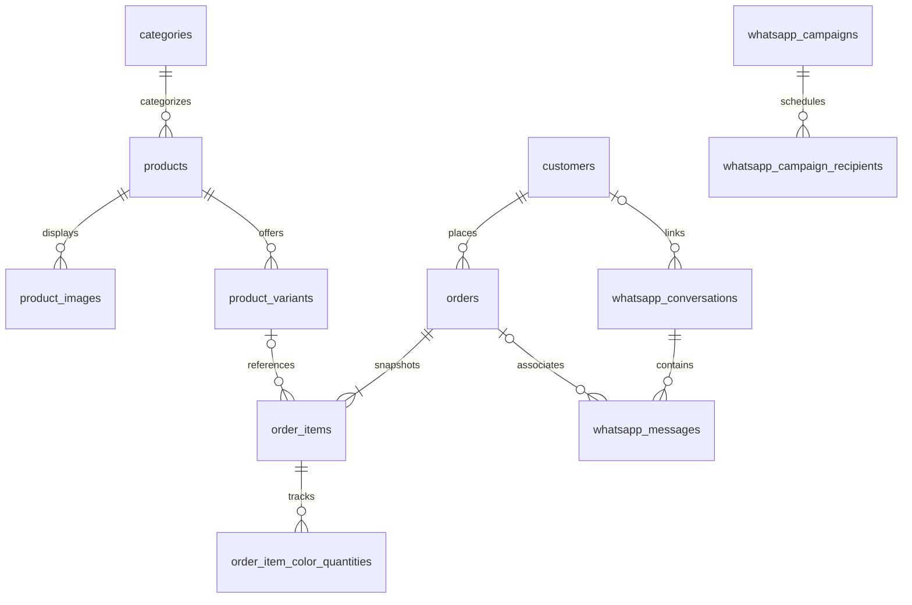

# Architecture

## System boundary

This is a wholesale order-capture and fulfillment coordination application. It owns catalog presentation, customer contact records, accepted order snapshots and operational messaging. External accounting codes remain business identifiers; accounting balances, payments and inventory transactions are outside its boundary.

One Laravel process serves both the Inertia storefront and the Filament panel. Vue handles storefront rendering and interaction. Filament/Livewire handle administration. Laravel routes, middleware, Eloquent models and database transactions remain the authority for mutations.

## Code map

| Location | Responsibility |
| --- | --- |
| [`routes/web.php`](../routes/web.php) | Catalog, cart, checkout, confirmation and locale routes |
| [`routes/whatsapp.php`](../routes/whatsapp.php) | Stateless signed provider callback |
| [`routes/console.php`](../routes/console.php) | Campaign/recovery schedule |
| [`bootstrap/app.php`](../bootstrap/app.php) | Routing, health route and middleware registration |
| [`app/Http/Controllers/`](../app/Http/Controllers) | Storefront and callback orchestration |
| [`app/Http/Middleware/`](../app/Http/Middleware) | Locale, shared Inertia props and webhook verification |
| [`app/Models/`](../app/Models) | Persistence, domain validation and controlled order transitions |
| [`app/Support/Cart.php`](../app/Support/Cart.php) | Session lines and server-derived cart representation |
| [`app/Support/CatalogPresenter.php`](../app/Support/CatalogPresenter.php) | Explicit public catalog payload |
| [`app/Filament/`](../app/Filament) | Admin resources, operations screens and dashboard widgets |
| [`app/Support/Imports/`](../app/Support/Imports) | Header parsing, row transactions and results |
| [`app/Support/Exports/`](../app/Support/Exports) | Query-based Excel exports and safe value binding |
| [`app/Support/WhatsApp/`](../app/Support/WhatsApp) | Messaging values, inbox, rendering and dispatch logic |
| [`app/Services/WhatsApp/`](../app/Services/WhatsApp) | WAHA and unavailable-driver adapters |
| [`app/Jobs/`](../app/Jobs) | Queued dispatch execution |
| [`resources/js/`](../resources/js) | Vue pages, local components and composables |
| [`resources/css/`](../resources/css) | Storefront and Filament themes |
| [`lang/`](../lang) | Arabic/English translations |
| [`database/migrations/`](../database/migrations) | Incremental schema and historical data transformations |
| [`tests/`](../tests) | Unit, feature, frontend and isolated real-engine verification |

## Domain relationships

The diagram highlights business relationships rather than every table/column. The migrations are the schema authority. Laravel also uses users, sessions, cache/locks and jobs tables; messaging adds templates, dispatches and recipient state.

### Catalog and quantities

Products have unique external codes, slugs, active flags, optional category links, price visibility and selection switches. Variants carry color/size combinations and a non-negative reference quantity. Configured colors and sizes determine selectable options and defaults for bulk imports.

Selection switches control the ordering interaction rather than deleting variant definitions. A cart line can refer to a grouped selection of variant IDs. Requested quantity is per selected color, while total physical pieces multiply that quantity by the color count. With explicit size selection disabled, the quantity must distribute evenly across assigned sizes for each selected color.

The public payload includes only what the storefront needs. Exact reference stock and internal request-price values are excluded. Catalog pages do not serialize raw Eloquent products directly.

### Checkout consistency

[`OrderController`](../app/Http/Controllers/OrderController.php) validates customer fields, hydrates the session cart, reloads product/variant data and validates the selection and distribution before creating records. [`Customer::matchOrCreate`](../app/Models/Customer.php) uses normalized phone matching and a database lock row for concurrent matches. Existing customer codes are preserved.

The transaction writes the order and item snapshots. Order numbers use the `ORD-YYYY-NNNNN` format with a unique database constraint and bounded collision retries. Cart clearing and the success redirect follow successful creation. Refreshing the success page reads an order number; it does not submit another checkout.

The success page exposes only the confirmation number. Customer details and previous-order history remain in authenticated Admin screens. A confirmation URL is not a customer account or an authenticated order-history endpoint.

### Order execution

[`Order`](../app/Models/Order.php) owns confirmation, cancellation, item editing and fulfillment mutations. These methods check current persisted status under row locks. Only a new order can be edited/cancelled. Item edits validate ownership and quantities; quantity-only edits preserve snapshots while changed variants get new trusted snapshots.

Fulfillment records per-color delivered quantities and maintains aggregate item/order status. Over-delivery and stale expected quantities are rejected. Historical unallocated delivery totals require explicit reconciliation before additional partial fulfillment. Referenced active-order products/variants have deletion guards.

No transition reserves, deducts or restores available stock. Production requirements show outstanding pieces from accepted order snapshots, not a warehouse ledger or materials-planning system.

### Spreadsheet boundaries

Imports run one transaction per row and provide explicit row outcomes. The upload resides on the private local disk and is deleted after processing. Product code matching supports non-destructive catalog updates. The bundled XLSX contains template structure and blank input rows, not operational records.

Exports are synchronous authenticated downloads. [`BusinessExport`](../app/Support/Exports/BusinessExport.php) reads in query chunks, binds strings as text, preserves numeric zeros and formats dates in `Africa/Cairo`. Order product fields come from snapshots; customer fields come from the associated customer record.

Order export has one row per stored item snapshot, which may represent multiple selected colors/sizes. The separate production-requirements export uses the finer ordered-color grain. These layouts should not be confused with a contract for an external accounting importer.

## Messaging boundary

[`WhatsAppGateway`](../app/Contracts/WhatsAppGateway.php) is the adapter boundary. [`AppServiceProvider`](../app/Providers/AppServiceProvider.php) selects the implemented WAHA adapter or a fail-closed unavailable adapter. Business tables live in Laravel's database; provider sessions and pairing state belong to WAHA.

Automatic notification snapshots are persisted before publishing a database job after commit. Provider failures do not invalidate a completed customer order. Manual inbox sends are synchronous; automated sends and campaigns use persisted dispatch jobs. See [WhatsApp integration](WHATSAPP.md) for the different recovery semantics.

## Trust boundaries and deliberate tradeoffs

- **Storefront input is untrusted.** Fresh database reads and validation determine accepted order data; browser prices and totals are not authoritative.
- **Admin is a trusted operator boundary.** Every application user can access the panel; finer roles are not implemented.
- **Uploads are untrusted.** File limits, spreadsheet contracts, row validation and formula-safe exports provide distinct checks. Invalid imports are visible to operators.
- **Callbacks need independent authentication.** They do not use session/CSRF middleware; raw-body HMAC and timestamp checks are required.
- **Third-party acknowledgements are imperfect.** Provider acceptance is not proof of delivery/read. Uncertain outcomes are retained rather than silently replayed.
- **Native primitives before custom layers.** Eloquent, transactions, Laravel validation, sessions and database queues keep deployment small. Messaging adapters and import/export helpers correspond to concrete integration boundaries.
- **SQLite is a fast regression engine, not concurrency proof.** Lock and engine behavior require separate real-engine evidence.

The source contains neither a general audit log nor a complete production monitoring platform. Deployment examples and passing automated checks do not establish operational readiness on their own.
